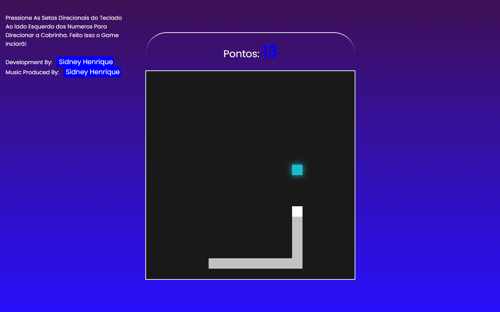
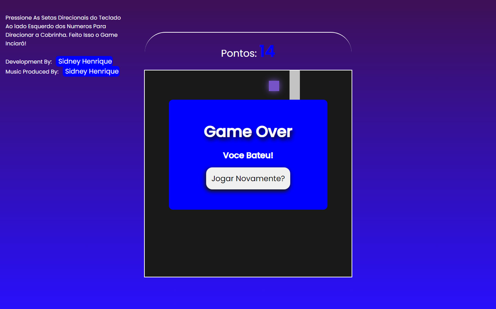

# snakegame

Este é um simples jogo da cobrinha Desenvolvido com as linguagens HTML, CSS e a Linguagem de Programacao JavaScript.

## Como Jogar

1. Abra o arquivo `index.html` em seu navegador.
2. Use as setas do teclado para controlar a direção da cobrinha.
3. Tente comer as comidas para aumentar o comprimento da cobrinha.
4. Evite colidir com as bordas do jogo ou consigo mesma.

## Pré-requisitos

Certifique-se de ter um navegador web moderno instalado para jogar o game.

## Estrutura do Projeto

- `index.html`: Contém a estrutura HTML do jogo.
- `style.css`: Arquivo de estilo para o layout do jogo.
- `script.js`: Lógica do jogo implementada em JavaScript.

## Imagens do Game

## Imagem Game Over

## Jogue Agora Mesmo AQUI
<a href="https://sidneyhenriquedev.github.io/snakegame/" target="_blank">JOGUE AGORA!</a>

## Contribuição

Sinta-se à vontade para contribuir para este projeto. Se você tiver sugestões de melhorias ou encontrar problemas, abra uma nova issue ou envie um pull request.

## Licença

Este projeto tem um codigo de licença aberto fique a vontade para desfrutar!

---

Divirta-se jogando!

